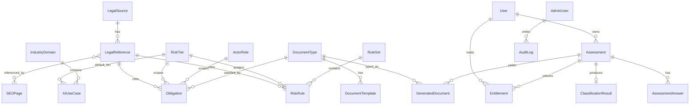

# Data Model & Schema — EU AI Act Compliance Navigator

| | |
|---|---|
| **Companion to** | [`technical-design.md`](./technical-design.md) §8 |
| **Source PRD** | §13 (Data Model), §10 (versioning), §11.5 (no logic in models) |
| **Engine** | PostgreSQL 16 (Neon) · SQLAlchemy 2.0 ORM · Alembic migrations |
| **Status** | Draft for review |

This document is the exhaustive schema specification. It expands PRD §13 with column types, constraints, indexes, enums, JSONB shapes, and reference DDL. The DDL is **illustrative design**, not a migration to run — Alembic migrations are generated at build time.

---

## 1. Conventions

- **IDs:** `BIGINT GENERATED ALWAYS AS IDENTITY` primary keys for internal joins; a separate public `ULID`/`uuid` column (`public_id`) for externally exposed identifiers (e.g. `aia_123`). Internal FKs use the BIGINT.
- **Timestamps:** `created_at` / `updated_at` as `TIMESTAMPTZ DEFAULT now()`; `updated_at` maintained by trigger or app layer.
- **Soft state via status enums**, not deletion, for legal entities (`draft/active/superseded/archived`). Hard deletes only for GDPR erasure of user data.
- **JSONB** for flexible/contractual blobs, always paired with a JSON Schema in `packages/rule-schema/`.
- **No business logic in ORM models** (PRD §11.5) — these tables are plain rows; behavior lives in `services/` and `rules/`.
- **Immutability:** published legal/rule versions and generated documents are append-only.
- Naming: `snake_case` tables/columns; FK columns suffixed `_id`.

### 1.1 Enumerations

| Enum | Values |
|---|---|
| `source_type` | `regulation`, `guidance`, `standard`, `regulator_page`, `commentary` |
| `entity_status` | `draft`, `active`, `superseded`, `archived` |
| `risk_tier_slug` | `prohibited`, `high_risk`, `limited_risk`, `minimal_risk`, `needs_review` |
| `actor_role_slug` | `provider`, `deployer`, `importer`, `distributor`, `authorised_representative`, `affected_person` |
| `assessment_status` | `draft`, `in_progress`, `completed`, `locked` |
| `classification_status` | `classified`, `insufficient_information`, `needs_expert_review`, `conflicting_rules` |
| `confidence_level` | `low`, `medium`, `high` |
| `document_format` | `pdf`, `docx`, `md`, `csv`, `xlsx`, `zip` |
| `seo_page_type` | `industry`, `use_case`, `template`, `article`, `annex`, `comparison`, `role` |
| `entitlement_sku` | `starter_report`, `evidence_pack`, `readiness_sprint`, `team_workspace` |
| `entitlement_status` | `pending`, `active`, `revoked`, `expired` |

---

## 2. Entity-relationship overview



---

## 3. Core legal-knowledge entities

### 3.1 `legal_source` (PRD §13 `LegalSource`)

| Column | Type | Notes |
|---|---|---|
| `id` | BIGINT PK | |
| `title` | TEXT NOT NULL | |
| `source_type` | `source_type` NOT NULL | |
| `jurisdiction` | TEXT NOT NULL | e.g. `EU` |
| `url` | TEXT | |
| `publication_date` | DATE | |
| `effective_date` | DATE | |
| `retrieved_at` | TIMESTAMPTZ | provenance |
| `version_label` | TEXT NOT NULL | e.g. `2024/1689-consolidated-2026-01` |
| `status` | `entity_status` NOT NULL DEFAULT `draft` | |
| `supersedes_id` | BIGINT FK → legal_source(id) | version chain |
| `created_at` / `updated_at` | TIMESTAMPTZ | |

Indexes: `(status)`, `(jurisdiction)`, unique `(title, version_label)`.

### 3.2 `legal_reference` (PRD §13 `LegalReference`)

Atomic, citable units (an article/annex point) used by rules, obligations, documents, and pages.

| Column | Type | Notes |
|---|---|---|
| `id` | BIGINT PK | |
| `legal_source_id` | BIGINT FK → legal_source | |
| `article_number` | TEXT | e.g. `26` |
| `annex_number` | TEXT | e.g. `III` |
| `section_label` | TEXT | e.g. `point 4(a)` |
| `reference_text_summary` | TEXT | neutral paraphrase (no copyrighted full text of paid standards — PRD §22) |
| `canonical_citation` | TEXT NOT NULL | e.g. `Regulation (EU) 2024/1689 Annex III point 4(a)` |
| `url_fragment` | TEXT | deep link |
| `created_at` / `updated_at` | TIMESTAMPTZ | |

Indexes: `(legal_source_id)`, `(article_number)`, `(annex_number)`, unique `(legal_source_id, canonical_citation)`.

### 3.3 `actor_role` (PRD §13 `ActorRole`)

| Column | Type | Notes |
|---|---|---|
| `id` | BIGINT PK | |
| `slug` | `actor_role_slug` UNIQUE NOT NULL | |
| `name` | TEXT NOT NULL | |
| `description` | TEXT | |

Seeded reference data (provider, deployer, importer, distributor, authorised representative, affected person).

### 3.4 `risk_tier` (PRD §13 `RiskTier`)

| Column | Type | Notes |
|---|---|---|
| `id` | BIGINT PK | |
| `slug` | `risk_tier_slug` UNIQUE NOT NULL | |
| `name` | TEXT NOT NULL | |
| `description` | TEXT | |
| `severity_order` | SMALLINT | for stable ordering (prohibited highest) |

---

## 4. Taxonomy entities

### 4.1 `industry_domain` (PRD §13 `IndustryDomain`)

| Column | Type | Notes |
|---|---|---|
| `id` | BIGINT PK | |
| `slug` | TEXT UNIQUE NOT NULL | e.g. `hr-tech` |
| `name` | TEXT NOT NULL | |
| `description` | TEXT | |

### 4.2 `ai_use_case` (PRD §13 `AIUseCase`)

| Column | Type | Notes |
|---|---|---|
| `id` | BIGINT PK | |
| `industry_domain_id` | BIGINT FK → industry_domain | |
| `slug` | TEXT NOT NULL | |
| `name` | TEXT NOT NULL | |
| `description` | TEXT | |
| `example_systems` | JSONB | array of strings |
| `default_risk_tier_id` | BIGINT FK → risk_tier | non-binding hint for pSEO |
| `is_annex_iii_candidate` | BOOLEAN NOT NULL DEFAULT false | |
| `created_at` / `updated_at` | TIMESTAMPTZ | |

Indexes: unique `(industry_domain_id, slug)`.

---

## 5. Rule & obligation entities

### 5.1 `rule_set` (versioning container — extends PRD)

Groups `risk_rule` rows into an immutable, publishable version (TDD §11).

| Column | Type | Notes |
|---|---|---|
| `id` | BIGINT PK | |
| `version` | INTEGER UNIQUE NOT NULL | monotonically increasing |
| `status` | `entity_status` NOT NULL DEFAULT `draft` | exactly one `active` (partial unique index) |
| `legal_source_version` | TEXT | source snapshot label this set assumes |
| `notes` | TEXT | changelog |
| `published_at` | TIMESTAMPTZ | |
| `created_at` | TIMESTAMPTZ | |

Constraint: `CREATE UNIQUE INDEX one_active_ruleset ON rule_set (status) WHERE status = 'active';`

### 5.2 `risk_rule` (PRD §13 `RiskRule`)

| Column | Type | Notes |
|---|---|---|
| `id` | BIGINT PK | |
| `rule_set_id` | BIGINT FK → rule_set | |
| `rule_code` | TEXT NOT NULL | e.g. `annex_iii_employment_recruitment_selection` |
| `name` | TEXT NOT NULL | |
| `description` | TEXT | |
| `priority` | INTEGER NOT NULL | lower = evaluated earlier; ties broken by `rule_code` |
| `risk_tier_id` | BIGINT FK → risk_tier | tier assigned on match |
| `condition_json` | JSONB NOT NULL | boolean AST (see §9.1) |
| `legal_reference_id` | BIGINT FK → legal_reference | source trace |
| `effective_from` | DATE | time-aware evaluation |
| `effective_to` | DATE | nullable = open-ended |
| `status` | `entity_status` NOT NULL DEFAULT `draft` | |
| `version` | INTEGER NOT NULL | rule-level revision |
| `created_at` / `updated_at` | TIMESTAMPTZ | |

Indexes: `(rule_set_id)`, `(priority)`, unique `(rule_set_id, rule_code)`, GIN on `condition_json`.

### 5.3 `obligation` (PRD §13 `Obligation`)

| Column | Type | Notes |
|---|---|---|
| `id` | BIGINT PK | |
| `title` | TEXT NOT NULL | |
| `description` | TEXT | |
| `actor_role_id` | BIGINT FK → actor_role | |
| `risk_tier_id` | BIGINT FK → risk_tier | |
| `legal_reference_id` | BIGINT FK → legal_reference | NOT NULL (source-cited guarantee) |
| `mandatory` | BOOLEAN NOT NULL DEFAULT true | |
| `evidence_required` | TEXT | what evidence proves compliance |
| `document_type_id` | BIGINT FK → document_type | nullable |
| `deadline_logic` | JSONB | optional applicability/timing logic |
| `applicability_json` | JSONB | optional condition AST (when obligation only applies in cases) |
| `created_at` / `updated_at` | TIMESTAMPTZ | |

Indexes: `(actor_role_id, risk_tier_id)`, `(document_type_id)`.

---

## 6. Document entities

### 6.1 `document_type` (PRD §13 `DocumentType`)

| Column | Type | Notes |
|---|---|---|
| `id` | BIGINT PK | |
| `slug` | TEXT UNIQUE NOT NULL | e.g. `annex-iv-technical-documentation` |
| `name` | TEXT NOT NULL | |
| `description` | TEXT | |
| `output_formats` | JSONB | array of `document_format` |

### 6.2 `document_template` (PRD §13 `DocumentTemplate`)

| Column | Type | Notes |
|---|---|---|
| `id` | BIGINT PK | |
| `document_type_id` | BIGINT FK → document_type | |
| `template_name` | TEXT NOT NULL | |
| `template_body` | TEXT NOT NULL | Jinja2/Typst/markdown body with variables |
| `variables_schema_json` | JSONB NOT NULL | JSON Schema of required variables (FR-DG-003) |
| `version` | INTEGER NOT NULL | |
| `status` | `entity_status` NOT NULL DEFAULT `draft` | |
| `created_at` / `updated_at` | TIMESTAMPTZ | |

Indexes: unique `(document_type_id, template_name, version)`.

---

## 7. User & assessment entities

### 7.1 `user`

Lightweight for leads (email only), richer when authenticated via Clerk.

| Column | Type | Notes |
|---|---|---|
| `id` | BIGINT PK | |
| `public_id` | TEXT UNIQUE | external id |
| `auth_provider_id` | TEXT UNIQUE | Clerk user id (nullable for pure leads) |
| `email` | CITEXT UNIQUE NOT NULL | |
| `company_name` | TEXT | |
| `role` | TEXT NOT NULL DEFAULT `user` | `user` / `admin` |
| `marketing_consent` | BOOLEAN DEFAULT false | |
| `created_at` / `updated_at` | TIMESTAMPTZ | |

### 7.2 `assessment` (PRD §13 `Assessment`)

| Column | Type | Notes |
|---|---|---|
| `id` | BIGINT PK | |
| `public_id` | TEXT UNIQUE NOT NULL | e.g. `aia_123` |
| `user_id` | BIGINT FK → user | nullable until claimed |
| `company_name` | TEXT | |
| `system_name` | TEXT | |
| `status` | `assessment_status` NOT NULL DEFAULT `draft` | |
| `rule_version` | INTEGER | snapshot at completion (FR-AW-003) |
| `source_version` | TEXT | snapshot at completion |
| `question_set_version` | INTEGER | snapshot at completion |
| `created_at` | TIMESTAMPTZ | |
| `completed_at` | TIMESTAMPTZ | |
| `locked_at` | TIMESTAMPTZ | set on paid snapshot (PRD §9.2) |

Indexes: `(user_id)`, `(status)`.

### 7.3 `assessment_answer` (PRD §13 `AssessmentAnswer`)

| Column | Type | Notes |
|---|---|---|
| `id` | BIGINT PK | |
| `assessment_id` | BIGINT FK → assessment | |
| `question_key` | TEXT NOT NULL | |
| `answer_value_json` | JSONB NOT NULL | typed by question schema |
| `created_at` / `updated_at` | TIMESTAMPTZ | |

Indexes: unique `(assessment_id, question_key)` (upsert key).

### 7.4 `classification_result` (PRD §13 `ClassificationResult`)

| Column | Type | Notes |
|---|---|---|
| `id` | BIGINT PK | |
| `assessment_id` | BIGINT FK → assessment | |
| `classification_status` | `classification_status` NOT NULL | `classified` or a special state |
| `risk_tier_id` | BIGINT FK → risk_tier | nullable for special states |
| `actor_role_id` | BIGINT FK → actor_role | primary role |
| `confidence` | `confidence_level` | |
| `result_json` | JSONB NOT NULL | full trace: triggered/non-triggered rules, sources, inputs used, obligations, required docs, edge flags (FR-RE-002) |
| `rule_version` | INTEGER NOT NULL | |
| `source_version` | TEXT NOT NULL | |
| `created_at` | TIMESTAMPTZ | |

Indexes: `(assessment_id)`, `(risk_tier_id)`.

### 7.5 `generated_document` (PRD §13 `GeneratedDocument`)

| Column | Type | Notes |
|---|---|---|
| `id` | BIGINT PK | |
| `assessment_id` | BIGINT FK → assessment | |
| `report_id` | TEXT NOT NULL | groups all artifacts of one pack |
| `document_type_id` | BIGINT FK → document_type | |
| `file_path` | TEXT NOT NULL | R2 object key |
| `format` | `document_format` NOT NULL | |
| `checksum` | TEXT | integrity |
| `rule_version` | INTEGER NOT NULL | snapshot (FR-DG-004) |
| `source_version` | TEXT NOT NULL | snapshot |
| `created_at` | TIMESTAMPTZ | |

Indexes: `(assessment_id)`, `(report_id)`.

---

## 8. Monetization, SEO & audit entities

### 8.1 `entitlement` (extends PRD — gates generation)

| Column | Type | Notes |
|---|---|---|
| `id` | BIGINT PK | |
| `user_id` | BIGINT FK → user | |
| `assessment_id` | BIGINT FK → assessment | nullable for subscriptions |
| `sku` | `entitlement_sku` NOT NULL | |
| `status` | `entitlement_status` NOT NULL DEFAULT `pending` | |
| `stripe_customer_id` | TEXT | |
| `stripe_subscription_id` | TEXT | nullable |
| `stripe_checkout_session_id` | TEXT | |
| `expires_at` | TIMESTAMPTZ | for subscriptions |
| `created_at` / `updated_at` | TIMESTAMPTZ | |

Indexes: `(user_id)`, `(assessment_id)`, unique `(stripe_checkout_session_id)`.

### 8.2 `stripe_event` (webhook idempotency — TDD §7.5)

| Column | Type | Notes |
|---|---|---|
| `id` | BIGINT PK | |
| `stripe_event_id` | TEXT UNIQUE NOT NULL | dedupe key |
| `type` | TEXT NOT NULL | |
| `payload_json` | JSONB | |
| `processed_at` | TIMESTAMPTZ | |
| `created_at` | TIMESTAMPTZ | |

### 8.3 `seo_page` (PRD §13 `SEOPage`)

| Column | Type | Notes |
|---|---|---|
| `id` | BIGINT PK | |
| `slug` | TEXT UNIQUE NOT NULL | |
| `page_type` | `seo_page_type` NOT NULL | |
| `title` | TEXT NOT NULL | unique (test, PRD §21.3) |
| `meta_description` | TEXT NOT NULL | unique |
| `content_md` | TEXT NOT NULL | composed from records (FR-SEO-001) |
| `structured_data_json` | JSONB | JSON-LD (FAQ/Breadcrumb/SoftwareApplication/Article) |
| `canonical_url` | TEXT NOT NULL | |
| `last_reviewed_at` | TIMESTAMPTZ | (FR-SEO-004) |
| `rule_version` | INTEGER | |
| `status` | `entity_status` NOT NULL DEFAULT `draft` | sitemap = active only |
| `created_at` / `updated_at` | TIMESTAMPTZ | |

Constraints/Indexes: unique `(slug)`, unique `(title)`, unique `(meta_description)`, `(status)`, `(page_type)`.

### 8.4 `seo_page_reference` (join: page ↔ legal references)

Enforces "no page published without a legal-source reference" (PRD §21.3).

| Column | Type | Notes |
|---|---|---|
| `seo_page_id` | BIGINT FK → seo_page | |
| `legal_reference_id` | BIGINT FK → legal_reference | |

PK `(seo_page_id, legal_reference_id)`. Publish guard: a page cannot move to `active` with zero rows here.

### 8.5 `audit_log` (PRD §11.3)

| Column | Type | Notes |
|---|---|---|
| `id` | BIGINT PK | |
| `actor_user_id` | BIGINT FK → user | admin who acted |
| `action` | TEXT NOT NULL | e.g. `rule.publish` |
| `entity_type` | TEXT NOT NULL | |
| `entity_id` | TEXT NOT NULL | |
| `diff_json` | JSONB | before/after |
| `created_at` | TIMESTAMPTZ | append-only |

Indexes: `(entity_type, entity_id)`, `(actor_user_id)`, `(created_at)`.

---

## 9. JSONB shapes

### 9.1 `risk_rule.condition_json` (boolean AST — TDD §7.3)

```json
{
  "all": [
    { "field": "use_case_category", "operator": "equals", "value": "employment_recruitment" },
    { "field": "system_function", "operator": "contains_any",
      "value": ["filter_applications", "rank_candidates", "evaluate_candidates"] },
    { "field": "affects_natural_persons", "operator": "equals", "value": true }
  ]
}
```

Grammar: combinators `all|any|none`; leaf `{field, operator, value}`; operators `equals,not_equals,in,not_in,contains_any,contains_all,gte,lte,exists,is_true,is_false`. Validated by `packages/rule-schema/condition.schema.json`.

### 9.2 `classification_result.result_json`

```json
{
  "risk_tier": "high_risk",
  "confidence": "high",
  "primary_actor_role": "provider",
  "secondary_actor_roles": ["deployer_when_used_internally"],
  "triggered_rules": [
    { "rule_code": "annex_iii_employment_recruitment_selection",
      "source": "Regulation (EU) 2024/1689 Annex III point 4(a)",
      "rationale": "System filters and ranks job applications.",
      "inputs_used": { "use_case_category": "employment_recruitment", "affects_natural_persons": true } }
  ],
  "non_triggered_relevant_rules": [
    { "rule_code": "prohibited_social_scoring", "reason": "no general-purpose social scoring present" }
  ],
  "obligations": [
    { "obligation_id": 12, "actor_role": "provider", "source": "Art. 16",
      "summary": "Establish a quality management system", "document_type": "quality-management-checklist" }
  ],
  "required_documents": ["risk_classification_memo", "annex_iv_technical_documentation", "human_oversight_plan"],
  "edge_case_flags": [],
  "rule_version": 7,
  "source_version": "2024/1689-consolidated-2026-01"
}
```

### 9.3 `document_template.variables_schema_json` (FR-DG-003)

JSON Schema declaring required variables: `company_name`, `ai_system_name`, `version`, `intended_purpose`, `actor_role`, `risk_tier`, `triggered_references[]`, `data_categories[]`, `affected_persons[]`, `human_oversight_owner`, `monitoring_owner`, `incident_response_owner`. Missing required values surface as "⚠ needs input" (TDD §7.4).

### 9.4 `seo_page.structured_data_json`

Array of JSON-LD objects (`FAQPage`, `BreadcrumbList`, `SoftwareApplication`, `Article`) validated against schema.org before publish (PRD §21.3).

---

## 10. Reference DDL (illustrative excerpt)

```sql
CREATE TYPE entity_status AS ENUM ('draft','active','superseded','archived');
CREATE TYPE risk_tier_slug AS ENUM ('prohibited','high_risk','limited_risk','minimal_risk','needs_review');

CREATE TABLE legal_source (
  id              BIGINT GENERATED ALWAYS AS IDENTITY PRIMARY KEY,
  title           TEXT NOT NULL,
  source_type     TEXT NOT NULL,
  jurisdiction    TEXT NOT NULL,
  url             TEXT,
  publication_date DATE,
  effective_date  DATE,
  retrieved_at    TIMESTAMPTZ,
  version_label   TEXT NOT NULL,
  status          entity_status NOT NULL DEFAULT 'draft',
  supersedes_id   BIGINT REFERENCES legal_source(id),
  created_at      TIMESTAMPTZ NOT NULL DEFAULT now(),
  updated_at      TIMESTAMPTZ NOT NULL DEFAULT now(),
  UNIQUE (title, version_label)
);

CREATE TABLE rule_set (
  id              BIGINT GENERATED ALWAYS AS IDENTITY PRIMARY KEY,
  version         INTEGER NOT NULL UNIQUE,
  status          entity_status NOT NULL DEFAULT 'draft',
  legal_source_version TEXT,
  notes           TEXT,
  published_at    TIMESTAMPTZ,
  created_at      TIMESTAMPTZ NOT NULL DEFAULT now()
);
CREATE UNIQUE INDEX one_active_ruleset ON rule_set (status) WHERE status = 'active';

CREATE TABLE risk_rule (
  id              BIGINT GENERATED ALWAYS AS IDENTITY PRIMARY KEY,
  rule_set_id     BIGINT NOT NULL REFERENCES rule_set(id),
  rule_code       TEXT NOT NULL,
  name            TEXT NOT NULL,
  description     TEXT,
  priority        INTEGER NOT NULL,
  risk_tier_id    BIGINT NOT NULL REFERENCES risk_tier(id),
  condition_json  JSONB NOT NULL,
  legal_reference_id BIGINT REFERENCES legal_reference(id),
  effective_from  DATE,
  effective_to    DATE,
  status          entity_status NOT NULL DEFAULT 'draft',
  version         INTEGER NOT NULL DEFAULT 1,
  created_at      TIMESTAMPTZ NOT NULL DEFAULT now(),
  updated_at      TIMESTAMPTZ NOT NULL DEFAULT now(),
  UNIQUE (rule_set_id, rule_code)
);
CREATE INDEX risk_rule_condition_gin ON risk_rule USING GIN (condition_json);

CREATE TABLE assessment (
  id              BIGINT GENERATED ALWAYS AS IDENTITY PRIMARY KEY,
  public_id       TEXT NOT NULL UNIQUE,
  user_id         BIGINT REFERENCES "user"(id),
  company_name    TEXT,
  system_name     TEXT,
  status          TEXT NOT NULL DEFAULT 'draft',
  rule_version    INTEGER,
  source_version  TEXT,
  question_set_version INTEGER,
  created_at      TIMESTAMPTZ NOT NULL DEFAULT now(),
  completed_at    TIMESTAMPTZ,
  locked_at       TIMESTAMPTZ
);

CREATE TABLE assessment_answer (
  id              BIGINT GENERATED ALWAYS AS IDENTITY PRIMARY KEY,
  assessment_id   BIGINT NOT NULL REFERENCES assessment(id) ON DELETE CASCADE,
  question_key    TEXT NOT NULL,
  answer_value_json JSONB NOT NULL,
  created_at      TIMESTAMPTZ NOT NULL DEFAULT now(),
  updated_at      TIMESTAMPTZ NOT NULL DEFAULT now(),
  UNIQUE (assessment_id, question_key)
);
```

---

## 11. Data lifecycle & retention

| Data | Retention | Erasure (GDPR) |
|---|---|---|
| Lead emails / marketing | Until unsubscribe + legal window | Hard delete on request |
| Assessment answers/results | While account active; configurable | Cascade delete on user erasure |
| Generated documents (R2) | While entitlement active + grace | Delete objects + `generated_document` rows |
| Legal sources / rules / pages | Permanent (versioned, append-only) | Not user data — never erased |
| Audit log | Permanent (compliance) | Not user data |
| Stripe events | Retained for reconciliation | Contains no card data |

---

## 12. Integrity invariants (enforced by constraints + service checks)

1. Exactly one `rule_set` with `status='active'` (partial unique index).
2. Every `obligation.legal_reference_id` is NOT NULL (source-cited guarantee).
3. A `seo_page` cannot be `active` with zero `seo_page_reference` rows (publish guard).
4. `classification_result` with `classification_status != 'classified'` may have NULL `risk_tier_id` (ambiguity is valid).
5. `generated_document` rows are immutable after insert (no UPDATE in DAL).
6. `assessment` becomes immutable for answers once `locked_at` is set.
7. `stripe_event.stripe_event_id` unique → webhook idempotency.

---

*Companion: [`technical-design.md`](./technical-design.md) · [`api-contract.md`](./api-contract.md).*
