# Technical Design Document — EU AI Act Compliance Navigator & Evidence Pack Generator

| | |
|---|---|
| **Document** | Technical Design Document (TDD) |
| **Product** | EU AI Act Compliance Navigator & Evidence Pack Generator |
| **Version** | 1.0 |
| **Status** | Draft for review |
| **Date** | 2026-06-14 |
| **Source PRD** | `/Users/hme/Downloads/AI_Act_Compliance_pSEO_PRD.md` (PRD v1.0, 2026-06-13) |
| **Owners** | Engineering (TBD), Product (TBD), Legal/Rules (TBD) |
| **Related docs** | [`data-model.md`](./data-model.md), [`api-contract.md`](./api-contract.md), [`cost-model.md`](./cost-model.md), [`adr/`](./adr/) |

> **Reading guide.** This document is the engineering source of truth that translates the PRD into a concrete, buildable, AI-editor-friendly system design. It does **not** create any runnable code — it specifies *what to build and why*. Companion documents hold the exhaustive DDL ([data-model.md](./data-model.md)), the full REST contract ([api-contract.md](./api-contract.md)), the unit-economics model ([cost-model.md](./cost-model.md)), and the decision log ([ADRs](./adr/)).

---

## Table of contents

1. [Context & problem framing](#1-context--problem-framing)
2. [Goals & non-goals](#2-goals--non-goals)
3. [Architectural principles](#3-architectural-principles)
4. [System context (C4 level 1)](#4-system-context-c4-level-1)
5. [Technology stack selection & rationale](#5-technology-stack-selection--rationale)
6. [High-level architecture (C4 level 2)](#6-high-level-architecture-c4-level-2)
7. [Component design](#7-component-design)
   - 7.1 [pSEO content engine](#71-pseo-content-engine)
   - 7.2 [Assessment wizard & dynamic branching](#72-assessment-wizard--dynamic-branching)
   - 7.3 [Deterministic rule engine](#73-deterministic-rule-engine)
   - 7.4 [Document & evidence-pack generation pipeline](#74-document--evidence-pack-generation-pipeline)
   - 7.5 [Payments & monetization (Stripe)](#75-payments--monetization-stripe)
   - 7.6 [Authentication, authorization & accounts](#76-authentication-authorization--accounts)
   - 7.7 [Admin legal-source & rule console](#77-admin-legal-source--rule-console)
   - 7.8 [Notifications & email](#78-notifications--email)
8. [Data model overview](#8-data-model-overview)
9. [API contract overview](#9-api-contract-overview)
10. [Asynchronous jobs & queue design](#10-asynchronous-jobs--queue-design)
11. [Versioning & legal traceability strategy](#11-versioning--legal-traceability-strategy)
12. [Security, privacy & compliance](#12-security-privacy--compliance)
13. [Infrastructure, environments & deployment](#13-infrastructure-environments--deployment)
14. [Observability & operations](#14-observability--operations)
15. [Testing strategy](#15-testing-strategy)
16. [Recommended project structure](#16-recommended-project-structure)
17. [AI-editor-friendliness conventions](#17-ai-editor-friendliness-conventions)
18. [Non-functional requirements mapping](#18-non-functional-requirements-mapping)
19. [Risks & mitigations](#19-risks--mitigations)
20. [Phased roadmap mapped to the PRD](#20-phased-roadmap-mapped-to-the-prd)
21. [Open questions & decision log](#21-open-questions--decision-log)
22. [Appendix](#22-appendix)

---

## 1. Context & problem framing

The PRD selects the **EU AI Act compliance generator** as the strongest revenue opportunity among several pSEO product ideas. The product converts a structured description of an AI system into a **source-cited compliance path**: risk classification → role classification → obligation matrix → document checklist → evidence tracker → generated document pack → optional expert review.

Three product truths drive every technical decision in this document:

1. **The classification must be deterministic and source-traceable.** Legal status is never decided by an LLM. A versioned rule engine backed by versioned legal sources produces every binding result. LLMs are confined to *drafting readable prose after* a deterministic result exists (PRD §3, §11.1, §14.3, FR-RE-001).
2. **The paid output is a review-ready evidence-preparation pack, not a generic PDF or final legal opinion.** The economic engine is paid reports, evidence-prep packs, and implementation sprints — pSEO is acquisition, not the product (PRD §1, §5, §27).
3. **Everything is versioned.** Assessments, rules, legal sources, templates, and generated documents must record the exact versions that produced them, so results are reproducible and "regenerate under latest law" is a first-class feature (PRD §10.3 FR-DG-004/005, §13).

### 1.1 Primary jobs-to-be-done

| Actor | Job |
|---|---|
| AI vendor founder / PM | "Tell me my risk tier and what documents I need before a customer/auditor asks." |
| Compliance / legal lead | "Give me a source-mapped first draft so expert review is cheap and fast." |
| Consultant / DPO / law firm | "Automate intake and produce first-draft packs for my clients." |
| Internal admin (us) | "Update law/rules safely, see blast radius, and republish without breaking old reports." |

### 1.2 Business model the architecture must serve

Free risk check (lead magnet) → **$20 evidence-prep pack** → **$5k+ readiness sprint** → **$499+/mo workspace** (PRD §5, §23). The architecture is optimized so that the **marginal cost of one paid pack is a few cents** of compute and storage, while the one-time digital pack remains self-serve and low-friction. See [cost-model.md](./cost-model.md).

---

## 2. Goals & non-goals

### 2.1 Goals (MVP, mapped to PRD §7, §26)

- **G1** — Deterministic, explainable risk + role classification across ≥20 validated use cases with full source trace (PRD §26.2/3, §10.2).
- **G2** — A 5–10 minute assessment wizard with dynamic branching, save-and-resume, and versioned answers (PRD §7.2 F2, §10.1).
- **G3** — Evidence-pack generation as a downloadable ZIP of PDF/DOCX/MD/CSV/XLSX, each carrying a version snapshot (PRD §7.2 F5/F6, §10.3).
- **G4** — Stripe checkout for one-time reports/packs and subscriptions (PRD §7.2 F7, §26.5).
- **G5** — ≥50 live, unique, source-mapped pSEO pages with structured data + sitemap (PRD §16, §26.7).
- **G6** — Admin console to manage legal sources/rules, preview, publish a new rule version, and see change impact (PRD §7.2 F8, §10.5, §26.6).
- **G7** — Reproducibility: every result/document records rule + source versions; ambiguous cases never fake certainty (PRD §26.8/9, §11.1).

### 2.2 Non-goals (explicitly out of MVP, PRD §4.3, §8)

- Enterprise GRC replacement, full model observability / runtime monitoring.
- Real-time biometric identification, defense, public-sector law enforcement use cases.
- Team workspace collaboration depth, deep integrations (Jira/GitHub/Confluence), public API, multi-framework mapping (ISO 42001 / NIST / SOC2), legal marketplace — these are **post-MVP** (PRD §8). The design leaves clean seams for them (see §20).
- Providing legal *advice*. We produce **evidence preparation and workflow automation**; binding advice requires the expert-review path (PRD §19 risk, §22).

### 2.3 Design tenets carried from the PRD

- Deterministic-first, LLM-second (PRD §11.1).
- Strict file isolation; rule engine isolated from API; templates isolated from legal DB; **no business logic in ORM models** (PRD §11.5).
- pSEO pages are generated from structured DB records, never ad-hoc LLM text (PRD §10.4 FR-SEO-001).

---

## 3. Architectural principles

1. **Determinism is sacred.** The rule engine is a pure function: `classify(facts, ruleset_version, source_version) → result`. Same inputs ⇒ identical output, forever. No network calls, no randomness, no time-dependence inside evaluation (time is an explicit input via `effective_from/to`).
2. **Everything legal is versioned and immutable once published.** Rulesets and legal-source versions are append-only. Editing produces a new version; published versions are never mutated.
3. **Separation of concerns by layer, enforced by directory boundaries.** Routers → services → DAL → models. The rule engine and document renderers are standalone libraries with no web/ORM dependencies, so they are independently testable (PRD §11.5).
4. **Two languages, each where it is strongest.** TypeScript/Next.js for SEO + interactive UI; Python/FastAPI for the rule engine, document generation, and admin. The contract between them is a typed OpenAPI schema (single source of truth).
5. **Cheap to run, expensive to copy.** Serverless-friendly, scale-to-zero infra keeps fixed cost near zero pre-revenue; the moat (versioned legal knowledge graph + rule traces + use-case corpus) is data, not infrastructure (PRD §6.3).
6. **AI-editor-friendly by construction.** Small single-responsibility files, explicit types/schemas as the source of truth, colocated `AGENTS.md`, deterministic tests as guardrails (see §17).
7. **Fail loud on ambiguity.** `needs_expert_review`, `insufficient_information`, `conflicting_rules` are first-class outcomes, never silently coerced to a tier (PRD §10.2 FR-RE-003).

---

## 4. System context (C4 level 1)

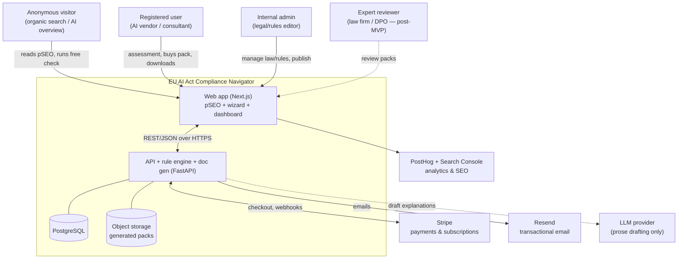

**Trust & data-flow boundaries**

- The browser never talks to the rule engine directly; all classification goes through the API, which authorizes and snapshots versions.
- Stripe is the only PCI surface; we store customer + price IDs, never card data.
- The LLM boundary is *write-only for prose*: it receives a deterministic result + neutral facts and returns human-readable text that is always labeled "explanatory, non-binding" and stored alongside its prompt hash for audit.

---

## 5. Technology stack selection & rationale

The PRD recommends a stack (Astro/Next, FastAPI, Postgres, SQLAlchemy, Celery/RQ+Redis, WeasyPrint/python-docx/openpyxl, Stripe, S3, PostHog) — §14.1. This section commits to a concrete, **cost-effective and revenue-oriented** instantiation and justifies each choice, including alternatives considered. Full unit economics are in [cost-model.md](./cost-model.md); the headline decision rationale is captured in [ADR-0001](./adr/0001-stack-and-topology.md).

### 5.1 Selected stack (committed)

| Layer | Choice | Why this, briefly |
|---|---|---|
| Web / pSEO / UI | **Next.js 15 (App Router) + TypeScript + Tailwind + shadcn/ui** | ISR/SSG gives fast, indexable, cheap pSEO; React Server Components keep JS small; one component lib that AI editors know well. |
| Backend / engine | **Python 3.12 + FastAPI + Pydantic v2** | Best ecosystem for document generation + a clean place for the deterministic rule engine; typed I/O; auto OpenAPI for the TS client. |
| ORM / migrations | **SQLAlchemy 2.0 + Alembic** | Mature, explicit, supports the strict "no logic in models" rule; deterministic migrations. |
| Database | **PostgreSQL 16 (Neon serverless)** | Scale-to-zero (near-$0 pre-revenue), DB branching per PR (great for AI dev + rule testing), JSONB for rule conditions, FTS for search. |
| Queue / cache | **Redis (Upstash serverless) + RQ** | Doc generation must be async/retryable (PRD §11.4); RQ is simpler than Celery and enough for our job shapes; Upstash bills per-request. |
| Object storage | **Cloudflare R2 (S3-compatible)** | Zero egress fees → downloads of packs cost ~nothing; signed URLs satisfy PRD §11.3. |
| Auth | **Clerk** (MVP) with a custom-JWT exit hatch | Generous free tier, fast to ship, handles RBAC + orgs for the future workspace; isolated behind our own `auth` port so we can swap to Supabase Auth / custom JWT later. |
| Payments | **Stripe** (Checkout + Billing + webhooks) | Category standard; Checkout removes PCI scope; Billing handles subscriptions. |
| Email | **Resend** (+ React Email templates) | Cheap, dev-friendly, good deliverability for transactional + secure download links. |
| Doc generation | **Typst** (PDF, primary) with **WeasyPrint** fallback; **python-docx** (DOCX); **openpyxl** (XLSX); **Jinja2** (MD) | Typst renders polished PDFs fast with low memory vs. headless Chrome; WeasyPrint kept as HTML/CSS fallback per PRD §14.1. |
| LLM (prose only) | **Provider-agnostic gateway** (start with a low-cost model; route via an interface) | Prose drafting is the only LLM use; abstract the vendor so cost can be optimized and the dependency stays optional. |
| Analytics / SEO | **PostHog Cloud (free tier) + Google Search Console** | Product analytics + funnel + SEO performance per PRD §14.1, §19. |
| Search | **Postgres FTS** first; **Meilisearch/Typesense** later | Matches PRD §14.1; defers cost until corpus is large. |
| Hosting | **Web → Vercel; API/worker → Render or Fly.io; DB → Neon; Redis → Upstash; files → R2** | All have meaningful free/cheap tiers; no fixed server cost until traffic justifies it. |
| Error tracking | **Sentry** (free dev tier) | Backend + frontend error visibility; the bundled Sentry skill is available for triage. |

### 5.2 Why a polyglot (TS + Python) split rather than one language

| Option | Pros | Cons | Verdict |
|---|---|---|---|
| **All-TypeScript** (Next.js + Node services) | One language; simplest for AI editors; type-sharing trivial | DOCX/XLSX/PDF generation and a legal rule DSL are weaker/less mature in Node; python-docx/openpyxl have no equal | Rejected for the engine |
| **All-Python** (FastAPI renders HTML, no Next.js) | One language; strong doc gen | Worse SEO ergonomics, more work for a modern interactive wizard; loses RSC/ISR cost+perf benefits for pSEO | Rejected for the web tier |
| **Polyglot: Next.js + FastAPI (chosen)** | Each tier uses the best tool; OpenAPI gives a typed contract; pSEO + doc-gen both first-class | Two toolchains, two deploy targets | **Chosen** — the contract is generated, not hand-written, which neutralizes most polyglot pain |

The polyglot seam is made safe by generating a **typed TypeScript client from the FastAPI OpenAPI schema** (e.g. `openapi-typescript` + a thin fetch wrapper). The backend Pydantic models are the single source of truth; the frontend never hand-rolls request/response types. See §9 and [api-contract.md](./api-contract.md).

### 5.3 Database choice rationale (Neon Postgres)

- **Cost:** scale-to-zero compute → effectively free when idle; pay for storage + active compute only. Ideal for a pre-revenue launch (see [cost-model.md](./cost-model.md)).
- **AI-dev workflow:** instant DB branches per PR/agent run let an AI editor (and CI) run rule-engine integration tests against an isolated copy, then throw it away.
- **Fit to data:** JSONB stores `condition_json` for rules and `answer_value_json` for assessments; Postgres FTS powers initial site search; relational integrity protects the versioned legal graph.
- **Alternatives:** Supabase (bundles auth+storage but couples more concerns), RDS (no scale-to-zero, higher idle cost), PlanetScale/MySQL (weaker JSONB + no native FK historically). Neon wins on idle cost + branching. See [ADR-0002](./adr/0002-database-neon-postgres.md).

### 5.4 Document-generation engine rationale (Typst primary)

PDF is the most expensive/finicky artifact. Options:

| Engine | PDF quality | Speed / memory | Footgun risk | Notes |
|---|---|---|---|---|
| Headless Chrome (Puppeteer/Playwright) | Excellent | Heavy (200–400MB/instance), slow cold start | High in serverless | Overkill, costly |
| **WeasyPrint** (HTML/CSS→PDF) | Good | Moderate | System libs (pango/cairo) | PRD's suggestion; kept as fallback |
| **Typst** | Excellent, typographic | Fast, low memory | Different markup language | **Primary** for the polished memo/procurement PDFs |

Strategy: author the **report layout once in Typst** for the premium PDFs (risk memo, procurement summary), and use **WeasyPrint from shared HTML** for simpler PDFs. DOCX templates use **python-docx** (editable, PRD §10.3 FR-DG-002); XLSX evidence trackers use **openpyxl**; Markdown uses **Jinja2**. The renderer layer is abstracted so a single `DocumentSpec` drives all formats (see §7.4). Rationale in [ADR-0004](./adr/0004-document-generation-pipeline.md).

### 5.5 Cost posture summary

The stack is chosen so **fixed monthly cost ≈ $0–$40 pre-traffic** (free tiers of Vercel/Neon/Upstash/R2/PostHog/Sentry + a small Render instance), scaling sub-linearly with revenue. With report prices of $199–$699 and per-pack marginal cost in cents, the **break-even is roughly one paid report per month**. The detailed model, including three-scenario projections aligned to PRD §5.2, lives in [cost-model.md](./cost-model.md).

---

## 6. High-level architecture (C4 level 2)

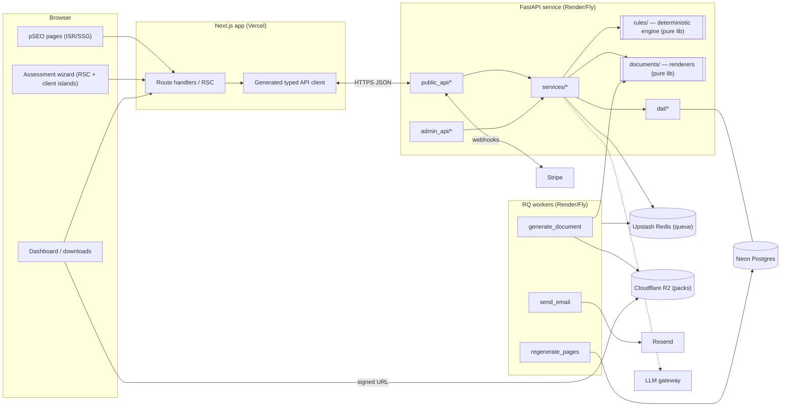

**Request/response paths (representative):**

- *pSEO page view:* Next.js renders from `SEOPage` records via ISR; no per-request API call needed at scale (the page content is built at revalidate time). Crawlers and AI overviews see static, source-cited HTML with structured data.
- *Free assessment:* wizard POSTs answers → `assessment_service` validates → `classification_service` runs the **pure rule engine** → result persisted with `rule_version` + `source_version` → free preview returned.
- *Paid pack:* checkout webhook marks entitlement → `generate_document` job enqueued → worker renders all artifacts → ZIP uploaded to R2 → user emailed a signed URL → dashboard exposes time-boxed download.
- *Rule update:* admin edits a draft ruleset → preview against fixtures → publish creates an immutable version → impact analysis recomputes affected pages/assessments → `regenerate_pages` job rebuilds pSEO content.

---

## 7. Component design

### 7.1 pSEO content engine

**Goal (PRD §7.2 F1, §10.4, §16):** generate many *unique, source-mapped, non-thin* pages from structured DB records (never ad-hoc LLM text), each with an interactive assessment CTA and downloadable asset.

**Page taxonomy (PRD §12.2):**

| Type | Route pattern | Driven by |
|---|---|---|
| Industry hub | `/eu-ai-act/{industry}/` | `IndustryDomain` |
| Use-case | `/eu-ai-act/{industry}/{use_case}/` | `AIUseCase` (+ default risk tier, Annex III candidacy) |
| Template | `/eu-ai-act/templates/{template_slug}/` | `DocumentType` + `DocumentTemplate` |
| Article/Annex | `/eu-ai-act/articles/{slug}/`, `/eu-ai-act/annexes/{slug}/` | `LegalReference` |
| Comparison/role | `/eu-ai-act/provider-vs-deployer/…`, `…/high-risk-vs-limited-risk/…` | composed records |

**Rendering model.** Each page is a row in `SEOPage` (`slug`, `page_type`, `title`, `meta_description`, `content_md`, `structured_data_json`, `canonical_url`, `last_reviewed_at`, `rule_version`, `status`). Next.js uses **ISR**: `generateStaticParams` enumerates active slugs, pages render at build/revalidate from the DB, and an admin "regenerate" action triggers on-demand revalidation. This keeps page loads <2s (PRD §11.2) at ~zero per-view cost.

**Content assembly.** A `seo_service` composes a page deterministically from records:

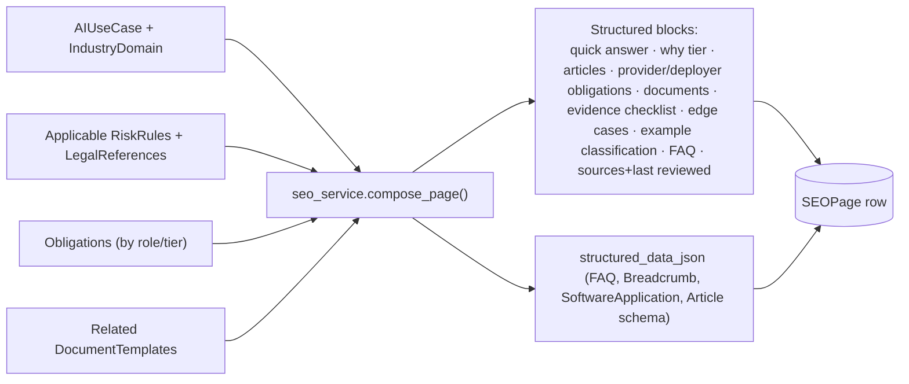

The page skeleton matches PRD §16.3. The **example classification** block reuses the real rule engine on a canned fact-set, so the page's answer cannot drift from the product's answer. LLM prose (optional) is limited to smoothing the "quick answer" / "edge cases" narrative and is regenerated only when the underlying records change — and is reviewable by admin before publish (PRD §7.2 F8).

**SEO guarantees (PRD §10.4, §21.3, §26.7):** unique titles/meta per page (DB-unique constraint + test), programmatic internal links to parent industry, related use-cases, related templates, article explainers, and the assessment CTA (FR-SEO-003), last-reviewed + rule/source version footer (FR-SEO-004), JSON-LD structured data (FR-SEO-005), sitemap containing only `status = active` pages, and a publish guard that **blocks any page lacking ≥1 legal-source reference** (PRD §21.3).

**AI-search adaptation (PRD §16.5):** concise answer blocks at the top, comparison tables, source citations, unique examples, downloadable assets, and an original "risk calculator" island — designed for citation in AI overviews while pulling high-intent users into the wizard.

### 7.2 Assessment wizard & dynamic branching

**Goal (PRD §7.2 F2, §10.1):** collect structured facts in 5–10 minutes with adaptive branching, save-and-resume, and versioned answers.

**Question model.** Questions are **data, not code**: a versioned `question_set` (JSON, stored and seeded) defines question groups (PRD §7.2 lists 15 groups), each with `question_key`, type (single/multi/boolean/text/"I don't know"), help text, examples, and **branching predicates** referencing earlier answers. This keeps the wizard editable without redeploys and keeps the frontend a generic renderer.

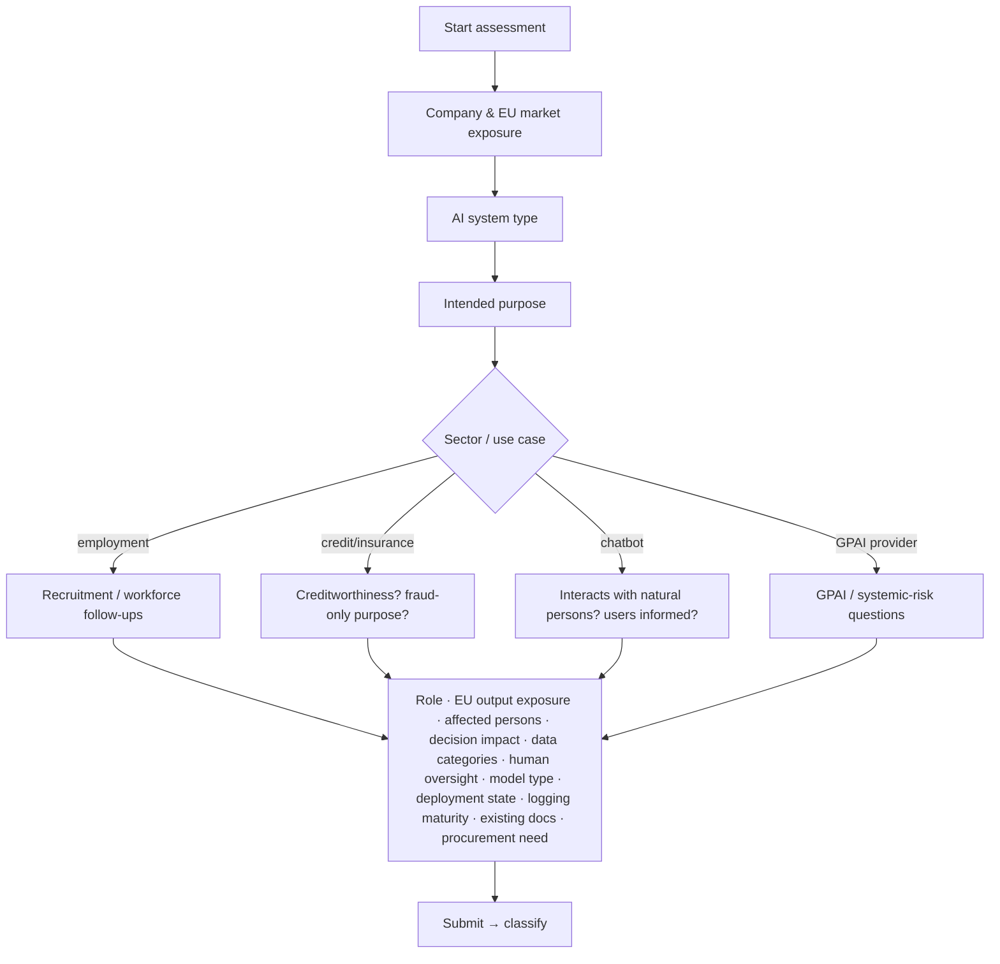

**Branching engine (FR-AW-001).** The same condition grammar used by the rule engine (§7.3) evaluates branching predicates client-side for UX and is re-validated server-side for integrity. Example: `use_case_category == employment_recruitment` reveals the recruitment sub-group.

**Save & resume (FR-AW-002).** Anonymous progress is keyed by an `assessment_id` (cookie/local token); on email capture or sign-in it is claimed by the user. Each answer is an upserted `AssessmentAnswer` row.

**Versioned answers (FR-AW-003).** On completion the `Assessment` snapshots `rule_version`, `source_version`, `question_set_version`, timestamp, and user id. Answers are immutable once the assessment is "completed/locked" for a paid snapshot (PRD §9.2 step 2).

**Completeness gate (FR-AW-004).** Before classification, `assessment_service.validate_required(facts, ruleset)` returns missing required keys; if any are missing the API returns `insufficient_information` with the specific follow-up questions — never a guessed tier.

### 7.3 Deterministic rule engine

This is the heart of the product and the moat (PRD §3, §6.3, §10.2, §14.3). It is a **pure, side-effect-free library** with no web or ORM dependencies, so it is trivially testable and reusable (PRD §11.5).

**Contract:**

```
classify(facts: NormalizedFacts, ruleset: RuleSet, sources: SourceIndex, now: date)
    -> Classification
```

`Classification` includes: `risk_tier` (one of `prohibited | high_risk | limited_risk | minimal_risk | needs_expert_review`), `confidence`, `primary_actor_role`, `secondary_actor_roles[]`, `triggered_rules[]`, `non_triggered_relevant_rules[]`, `source_trace[]`, `obligations[]`, `required_documents[]`, `edge_case_flags[]`, plus the special states `insufficient_information` and `conflicting_rules` (PRD §10.2 FR-RE-003).

**Execution order (PRD §14.3, FR-RE-004…007):**

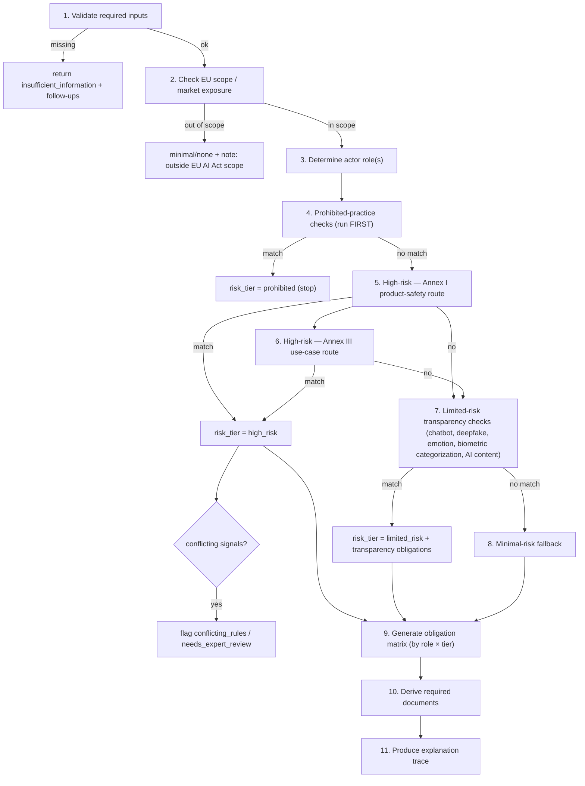

**Rule representation.** Each `RiskRule` carries `rule_code`, `priority`, `risk_tier_id`, `condition_json`, `legal_reference_id`, `effective_from/to`, `status`, `version`. Conditions use a small, safe boolean grammar (no `eval`):

```json
{
  "all": [
    { "field": "use_case_category", "operator": "equals", "value": "employment_recruitment" },
    { "field": "system_function", "operator": "contains_any",
      "value": ["filter_applications", "rank_candidates", "evaluate_candidates"] },
    { "field": "affects_natural_persons", "operator": "equals", "value": true }
  ]
}
```

Supported combinators: `all`, `any`, `none`. Operators: `equals`, `not_equals`, `in`, `not_in`, `contains_any`, `contains_all`, `gte`, `lte`, `exists`, `is_true`, `is_false`. The evaluator (`rules/conditions.py`) is a recursive interpreter over this AST — deterministic, sandboxed, and fully unit-tested.

**Determinism guarantees.**
- No I/O inside evaluation; `sources` and `ruleset` are passed in, already loaded.
- `now` is an explicit parameter so `effective_from/to` filtering is reproducible.
- Rule ordering is by explicit `priority`, with ties broken by `rule_code` (stable, total order).
- Conflicts (e.g., two mutually exclusive tiers both triggered, or an Annex III match contradicted by a stated exemption) raise `conflicting_rules` → routed to `needs_expert_review` rather than silently picking one (PRD §10.2).

**Explainable trace (FR-RE-002).** Every result lists triggered + non-triggered-but-relevant rules, the exact `LegalReference` (article/annex/section + canonical citation + URL fragment), the **input answers used**, a rationale string, and a confidence. The trace is the backbone of both the report appendix (PRD §17.1) and the pSEO "example classification" block.

**Obligation & document derivation (steps 9–10).** Given `(role, tier)` and triggered rules, the engine selects applicable `Obligation` rows (each linked to a `LegalReference` and optionally a `DocumentType`), producing the obligation matrix (PRD §17.3) and the dedup'd required-document set that the generation pipeline consumes.

**Why not an LLM / rules-as-code framework.** The legal liability profile (PRD §19, §22) mandates determinism and source traceability that an LLM cannot guarantee. A heavyweight external rules engine (Drools, etc.) is rejected for AI-editor-friendliness and footprint; a small, transparent, fully-owned interpreter is easier for both humans and AI editors to reason about and test. See [ADR-0003](./adr/0003-rule-engine-design.md).

### 7.4 Document & evidence-pack generation pipeline

**Goal (PRD §7.2 F5/F6, §10.3, §17):** turn a locked classification into editable, source-cited artifacts and a downloadable ZIP, each carrying a version snapshot.

**Pack contents (PRD §7.2 F6):** `01_risk_classification_memo.md`, `02_ai_system_card.md`, `03_obligation_matrix.csv`, `04_annex_iv_technical_documentation_template.docx`, `05_human_oversight_plan_template.docx`, `06_instructions_for_use_template.docx`, `07_fria_template.docx` (conditional), `08_eu_declaration_of_conformity_skeleton.docx` (conditional), `09_eu_database_registration_data_pack.csv` (conditional), `10_evidence_tracker.xlsx`, `11_customer_procurement_summary.pdf`.

**Pipeline:**

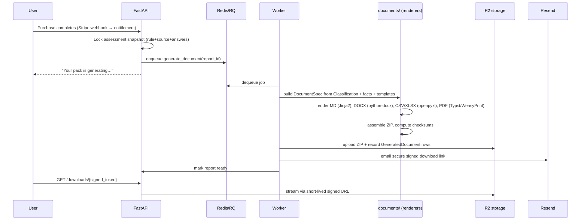

**Unified rendering abstraction.** A single `DocumentSpec` (typed) describes each artifact: which `DocumentTemplate`, the resolved variables (PRD §10.3 FR-DG-003 — company, system, version, role, tier, triggered article/annex refs, data categories, affected persons, oversight/monitoring/incident owners), and the target formats. Renderers are pure functions `render(spec) -> bytes`. This isolation (PRD §11.5) means templates live in `documents/templates/` and never touch the legal DB directly — they receive resolved, source-cited data.

**Source-cited everything (FR-DG-001).** Every obligation/section in a generated doc embeds its `LegalReference` (canonical citation + URL). The renderer fails the build if an obligation lacks a reference — mirroring the SEO publish guard.

**Locked snapshot (FR-DG-004).** Each `GeneratedDocument` records `assessment_id`, `report_id`, generated timestamp, `rule_version`, `source_version`, format, and `file_path`. Inputs are frozen at purchase time (PRD §9.2 step 2) so a pack is byte-reproducible.

**Regeneration (FR-DG-005).** When rules/sources change, a paid user can re-run generation under the latest version; the system diffs old vs. new classification and highlights what changed before regenerating.

**Missing-variable handling (PRD §21.2).** Unfilled template variables are surfaced as explicit "⚠ needs input" placeholders and listed in the report's "missing information warnings" (PRD §15.4), never silently blanked.

### 7.5 Payments & monetization (Stripe)

**Goal (PRD §5, §7.2 F7, §23):** sell one-time reports/packs and subscriptions; gate generation behind entitlement.

**Products & prices (mapped to PRD §23):**

| SKU | Type | Price | Entitlement |
|---|---|---|---|
| Risk Check | free | $0 | free preview result |
| Starter Report | one-time | $199 | report generation (PDF/MD/DOCX) |
| Evidence Pack | one-time | $699 | full ZIP pack |
| Readiness Sprint | service (invoice/deposit) | from $5,000 | booking + manual delivery |
| Team Workspace | subscription | from $499/mo | workspace features (post-MVP gating) |

**Checkout flow:**

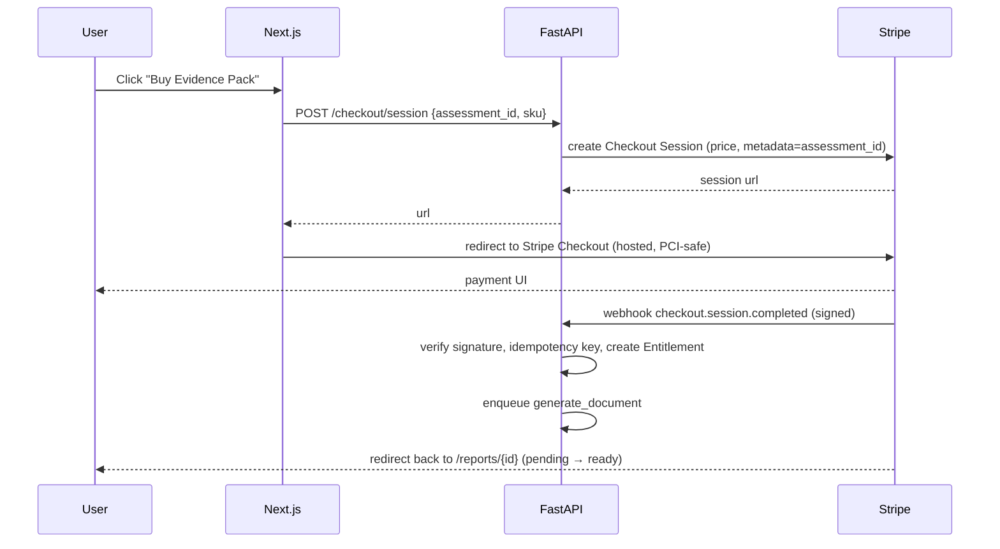

**Integrity rules.**
- **Webhook is the source of truth**, not the browser redirect. Entitlements are created only on verified `checkout.session.completed` / `invoice.paid`.
- **Idempotency**: every webhook is deduped by Stripe event id (stored), so retries never double-generate or double-charge effects.
- **Signature verification** on every webhook; reject unsigned/expired.
- Subscriptions handled via Stripe Billing; `customer.subscription.*` events drive workspace access state.
- We persist Stripe `customer_id`, `price_id`, `subscription_id`, event ids — **never** card data (PCI scope stays in Stripe).

### 7.6 Authentication, authorization & accounts

**Goal:** low-friction free flow (email capture only) → authenticated paid flow → admin RBAC (PRD §11.3).

- **Anonymous → email capture:** the free assessment requires only an email to view results (PRD §9.1). This creates a lightweight `User` (lead) without a password.
- **Authenticated accounts:** Clerk handles sign-in/up, sessions, and (future) organizations for the team workspace. The API trusts Clerk-issued JWTs verified via JWKS.
- **Auth port abstraction:** all auth lives behind an `auth` interface in the API (`get_current_user`, `require_role`). Clerk is one implementation; a custom-JWT or Supabase implementation can be swapped without touching routers — protecting against vendor lock-in/cost (PRD §14.1 lists multiple options).
- **RBAC (PRD §11.3, §10.5):** roles `anonymous`, `user`, `admin`. Admin-only routes (`admin_api/*`) require `require_role("admin")`. Legal-source changes are audit-logged (PRD §11.3).
- **Data ownership:** assessments/reports are scoped to a `user_id`; signed download tokens are user- and document-scoped and short-lived.

### 7.7 Admin legal-source & rule console

**Goal (PRD §7.2 F8, §10.5, §9.4):** manage the versioned legal knowledge graph safely.

Capabilities: CRUD on `LegalSource` / `LegalReference` (title, url, jurisdiction, type, effective date, version, status — FR-ADMIN-001); CRUD on `Obligation` and `RiskRule` with applicability logic (FR-ADMIN-002); **rule preview** against the fixture suite before publish (FR-ADMIN-003); **change-impact analysis** listing affected `SEOPage` slugs, `DocumentTemplate`s, and customer `Assessment`s (FR-ADMIN-004); publish a new immutable ruleset version; trigger pSEO regeneration; review generated examples before publication.

**Rule-update flow (PRD §9.4):**

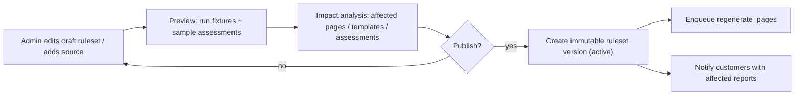

Publishing is a guarded transaction: a draft can only become `active` if the full fixture suite (PRD §21.1) passes against it, preventing a bad legal edit from shipping.

### 7.8 Notifications & email

Transactional email via Resend (React Email templates): email-capture confirmation, free-result link, **secure pack download link (signed, expiring)**, payment receipts (Stripe-driven), generation-complete, generation-failed (notifies user + admin per PRD §11.4), and rule-update notices to affected customers (PRD §9.4). All sent asynchronously via the `send_email` job.

---

## 8. Data model overview

The full schema, column types, constraints, indexes, and DDL are in [data-model.md](./data-model.md). The core entities (PRD §13) and their relationships:

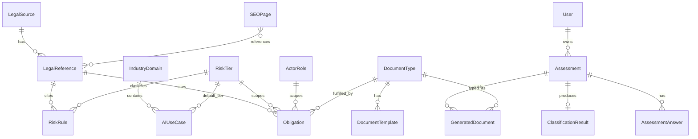

**Design notes**
- **No business logic in models** (PRD §11.5): entities are plain ORM rows; behavior lives in `services/` and `rules/`.
- **Versioning columns** (`rule_version`, `source_version`, `version`, `status`, `effective_from/to`) appear on every legal + generated entity to support reproducibility and rollback (PRD §10, §13).
- **JSONB** for `RiskRule.condition_json`, `AssessmentAnswer.answer_value_json`, `ClassificationResult.result_json`, `DocumentTemplate.variables_schema_json`, `SEOPage.structured_data_json`.
- **Immutability**: published `RiskRule`/`LegalSource` versions and `GeneratedDocument` snapshots are append-only; edits create new versions.
- **Audit log** table for admin legal-source/rule changes (PRD §11.3).

---

## 9. API contract overview

Full request/response schemas, status codes, error envelope, pagination, and examples are in [api-contract.md](./api-contract.md). FastAPI auto-generates the OpenAPI spec; the Next.js typed client is generated from it (single source of truth, §5.2). Surface (PRD §14.5):

| Group | Endpoints |
|---|---|
| Public pages | `GET /api/v1/pages/{slug}`, `GET /api/v1/pages?type=&industry=&risk_tier=` |
| Assessments | `POST /assessments`, `GET /assessments/{id}`, `PATCH /assessments/{id}`, `POST /assessments/{id}/answers`, `POST /assessments/{id}/classify`, `GET /assessments/{id}/result` |
| Documents | `POST /documents/generate`, `GET /documents/{id}`, `GET /downloads/{signed_token}` |
| Payments | `POST /checkout/session`, `POST /stripe/webhook` |
| Admin | `POST/PATCH /admin/legal-sources`, `POST/PATCH /admin/rules`, `POST /admin/rules/preview`, `POST /admin/rules/publish`, `POST /admin/seo-pages/regenerate` |

**Cross-cutting:** versioned prefix `/api/v1`; consistent JSON error envelope (`{error: {code, message, details}}`); idempotency keys on mutating + webhook routes; rate limiting on public assessment endpoints; the `classify` endpoint can return `insufficient_information` / `needs_expert_review` / `conflicting_rules` as **200 with a typed status field**, not an HTTP error (these are valid product outcomes).

---

## 10. Asynchronous jobs & queue design

Long/expensive work is queued and retryable (PRD §11.4). Jobs (PRD §14.2 `workers/`):

| Job | Trigger | Idempotency | Retry/backoff | On failure |
|---|---|---|---|---|
| `generate_document` | entitlement created | `report_id` unique; checks existing artifacts | 3 retries, exp backoff | mark report `failed`, notify user + admin |
| `regenerate_pages` | rule publish / admin action | per-slug; safe to re-run | per-page isolation | partial success; failed slugs logged |
| `send_email` | various | provider idempotency key | 5 retries | dead-letter + admin alert |

**Why RQ over Celery (PRD allows either):** our jobs are simple, low-concurrency, and the team optimizes for AI-editor legibility; RQ has far less configuration surface. The choice is isolated behind a thin `queue` interface so Celery can replace it if scale demands. Workers are stateless and horizontally scalable; the queue is Upstash Redis (serverless, pay-per-request).

---

## 11. Versioning & legal traceability strategy

This is the product's correctness backbone and a moat (PRD §6.3, §10, §11.1).

- **RuleSet versions** are immutable, monotonically increasing, with `status ∈ {draft, active, superseded, archived}`. Exactly one `active` set at a time; classification always pins the active version at assessment time.
- **LegalSource/LegalReference versions** track `version_label`, `status`, `effective_date`, `retrieved_at`. Superseding a source creates a new version and links the old one.
- **Assessment snapshot**: `rule_version + source_version + question_set_version + answers` are frozen on completion/purchase, guaranteeing reproducibility (FR-AW-003, FR-DG-004).
- **Generated documents** embed the same triplet, so any artifact can be regenerated byte-identically or compared against a newer ruleset (FR-DG-005).
- **Time-awareness**: rules carry `effective_from/to`; the engine receives `now` explicitly, so "what was the correct classification on date X" is answerable.
- **Change impact**: publishing computes the set of pages/templates/assessments referencing changed references/rules (FR-ADMIN-004) and drives regeneration + customer notices (PRD §9.4).

---

## 12. Security, privacy & compliance

Mapped to PRD §11.3 and §22 risk register.

| Area | Control |
|---|---|
| Data at rest | Postgres encryption (Neon-managed); R2 server-side encryption; sensitive assessment fields encrypted at app layer where warranted (PRD §11.3). |
| Data in transit | TLS everywhere; HSTS on web. |
| Downloads | Short-lived **signed URLs**; tokens scoped to user + document; no public buckets (PRD §11.3). |
| AuthZ | RBAC; admin routes gated; least-privilege service credentials. |
| Audit | Append-only audit log for legal-source/rule changes (PRD §11.3). |
| Data deletion | "Delete my data" workflow purges assessments/answers/results/docs + R2 objects (PRD §11.3, GDPR). |
| Model training | **Never** train models on customer submissions; LLM calls are zero-retention where the provider supports it (PRD §11.3). |
| Secrets | Per-environment secret stores (Vercel/Render env, never in repo); `.env.example` only. |
| Stripe | Webhook signature verification + idempotency; no card data stored. |
| Legal positioning | Product is "evidence preparation & workflow automation," not legal advice; disclaimers + expert-review path mitigate "users expect legal advice" risk (PRD §19, §22). |
| Input safety | Rule conditions evaluated by a sandboxed interpreter (no `eval`); template rendering escapes user input; uploads (post-MVP) virus-scanned. |
| Rate limiting / abuse | Throttle assessment + checkout endpoints; bot mitigation on public forms. |

A dedicated **GDPR/DPA posture** (data map, sub-processor list: Neon, R2, Clerk, Stripe, Resend, PostHog, LLM provider; retention schedule; DPA links) is tracked as a launch checklist item.

---

## 13. Infrastructure, environments & deployment

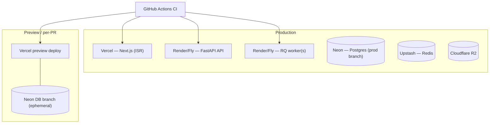

**Environments:** `local` (docker-compose: Postgres + Redis + MinIO as R2 stand-in), `preview` (per-PR Vercel + ephemeral Neon branch), `production`.

**CI/CD (GitHub Actions):** on PR → lint (ESLint/Prettier, Ruff), typecheck (tsc, mypy), unit + integration tests (incl. **full rule-engine fixture suite**, PRD §21.1), build, generate OpenAPI + TS client and assert no drift, Vercel preview, ephemeral Neon branch for DB-backed tests. On merge to `main` → migrate (Alembic), deploy API + workers, deploy web, run smoke tests. **Migrations are gated** so a deploy fails before serving if the schema/rule fixtures don't pass.

**Scaling path:** start everything on free/small tiers (single API instance, single worker, scale-to-zero DB). Scale workers horizontally for doc-gen load; add read replicas / Meilisearch only when metrics justify (PRD §14.1).

---

## 14. Observability & operations

- **Logs:** structured JSON logs (request id, user id, assessment id, rule_version) shipped to the platform log drain; correlate web ↔ api via a propagated request id.
- **Errors:** Sentry (frontend + backend), with the rule-engine raising typed errors that are alertable.
- **Metrics (PRD §19):** acquisition (indexed pages, impressions, clicks, assessment starts/completion, email capture) via PostHog + Search Console; activation/revenue funnels via PostHog + Stripe; quality (rule accuracy on fixtures, expert corrections per pack, time-from-law-update-to-rule-update, pages affected per change) via internal dashboards.
- **Health:** `/healthz` (liveness) and `/readyz` (DB/Redis/R2 reachability) on the API; queue depth + job failure alerts.
- **Runbooks:** doc-gen failure, webhook backlog, bad rule publish rollback (revert to previous active ruleset version — a one-row status flip thanks to immutability), DB branch cleanup.
- **SLOs (from PRD §11.2/4):** public page <2s p50; assessment result <10s; pack generation <2min; 99.5% uptime target.

---

## 15. Testing strategy

The deterministic core makes high-confidence testing cheap. Test pyramid:

| Level | Scope | Notes |
|---|---|---|
| **Rule-engine fixtures (highest priority)** | Every PRD §21.1 case: resume screening, candidate ranking, employee monitoring, credit scoring, fraud-detection exception, insurance pricing, healthcare triage, exam proctoring, customer chatbot, deepfake generation, spam filter | For each: assert correct tier, triggered rule, role obligations, document list, edge-case flags (PRD §21.1). These are golden tests that gate every rule publish. |
| Unit | condition interpreter, validators, renderers, services | Pure functions, fast. |
| Document tests (PRD §21.2) | required sections present, source refs included, variables filled, missing vars flagged, all export formats produced, download links expire | Snapshot + structural assertions. |
| SEO tests (PRD §21.3) | unique titles/meta, correct canonicals, schema validates, no page published without legal-source ref, sitemap only active pages | Run in CI against the page composer. |
| Integration | API routes against ephemeral Neon branch | Auth, entitlement gating, idempotency. |
| Contract | OpenAPI ↔ generated TS client drift check | Fails CI on mismatch. |
| E2E (Playwright) | wizard → free result → checkout (Stripe test mode) → pack download | Covers the money path. |
| Load (pre-launch) | doc-gen throughput, page TTFB | Validate NFR budgets. |

**Acceptance-criteria tests (PRD §26):** each of the 10 acceptance criteria is encoded as an automated or scripted check (e.g., "assessment completes <10 min," "≥20 validated use cases," "ZIP downloadable," "Stripe end-to-end," "admin publishes new rule version," "≥50 SEO pages live," "ambiguous handled without false certainty," "version stamping present," "docs editable").

---

## 16. Recommended project structure

> **Described, not created.** Per the current scope this section specifies the target layout for when implementation begins; no files are scaffolded now. It refines PRD §14.2 with explicit isolation and AI-editor ergonomics.

```text
ai-act-navigator/                  # monorepo root (pnpm workspaces + Turborepo for JS; uv for Python)
├─ AGENTS.md                       # root agent guide: architecture map + invariants
├─ README.md
├─ docs/                           # ← THIS deliverable lives here
│  ├─ technical-design.md
│  ├─ data-model.md
│  ├─ api-contract.md
│  ├─ cost-model.md
│  └─ adr/0001…/                   # decision records
├─ apps/
│  └─ web/                         # Next.js 15 (App Router, TS, Tailwind, shadcn/ui)
│     ├─ AGENTS.md
│     ├─ src/app/(marketing)/eu-ai-act/…   # pSEO routes (ISR)
│     ├─ src/app/(app)/assessment/…        # wizard
│     ├─ src/app/(app)/reports/…           # dashboard/downloads
│     ├─ src/components/…                   # shadcn/ui + product components
│     ├─ src/lib/api-client/                # GENERATED from OpenAPI (do not hand-edit)
│     └─ src/lib/seo/                        # structured-data builders, sitemap
├─ services/
│  └─ api/                         # FastAPI (mirrors PRD §14.2, expanded)
│     ├─ AGENTS.md
│     ├─ app/main.py · config.py · db.py
│     ├─ app/models.py             # ORM only — NO business logic
│     ├─ app/schemas.py            # Pydantic request/response (contract source)
│     ├─ app/dal/                  # data access: legal_sources, assessments, rules, documents, seo_pages, users
│     ├─ app/rules/                # PURE engine: engine, conditions, priorities, traces, validators
│     ├─ app/services/             # assessment, classification, document, seo, payment, notification, versioning
│     ├─ app/documents/            # renderers + pdf/docx/xlsx/markdown + templates/
│     ├─ app/public_api/           # assessments, pages, documents, checkout
│     ├─ app/admin_api/            # legal_sources, rules, templates, seo_pages
│     ├─ app/workers/              # generate_document, regenerate_pages, send_email
│     └─ tests/                    # test_risk_engine, test_documents, test_api, fixtures/
├─ packages/
│  ├─ shared-types/                # hand-authored cross-cutting TS types (enums mirrored from Python)
│  └─ rule-schema/                 # JSON Schema for condition_json + question_set (shared contract)
├─ infra/
│  ├─ docker-compose.yml           # local Postgres + Redis + MinIO
│  ├─ github-actions/              # CI workflows
│  └─ migrations/                  # Alembic
└─ data/
   └─ seeds/                       # legal sources, references, rules, use-cases, question sets, fixtures
```

**Isolation invariants (enforced by review + lint boundaries, PRD §11.5):**
- `rules/` and `documents/` import nothing from `public_api/`, `admin_api/`, `dal/`, or `models.py` — they are pure libraries.
- `services/` orchestrate; routers stay thin; DAL is the only layer touching the DB session.
- `models.py` holds no methods with business logic.
- `apps/web/src/lib/api-client/` is generated; edits go to the backend schema.

### 16.1 Layering & dependency rule

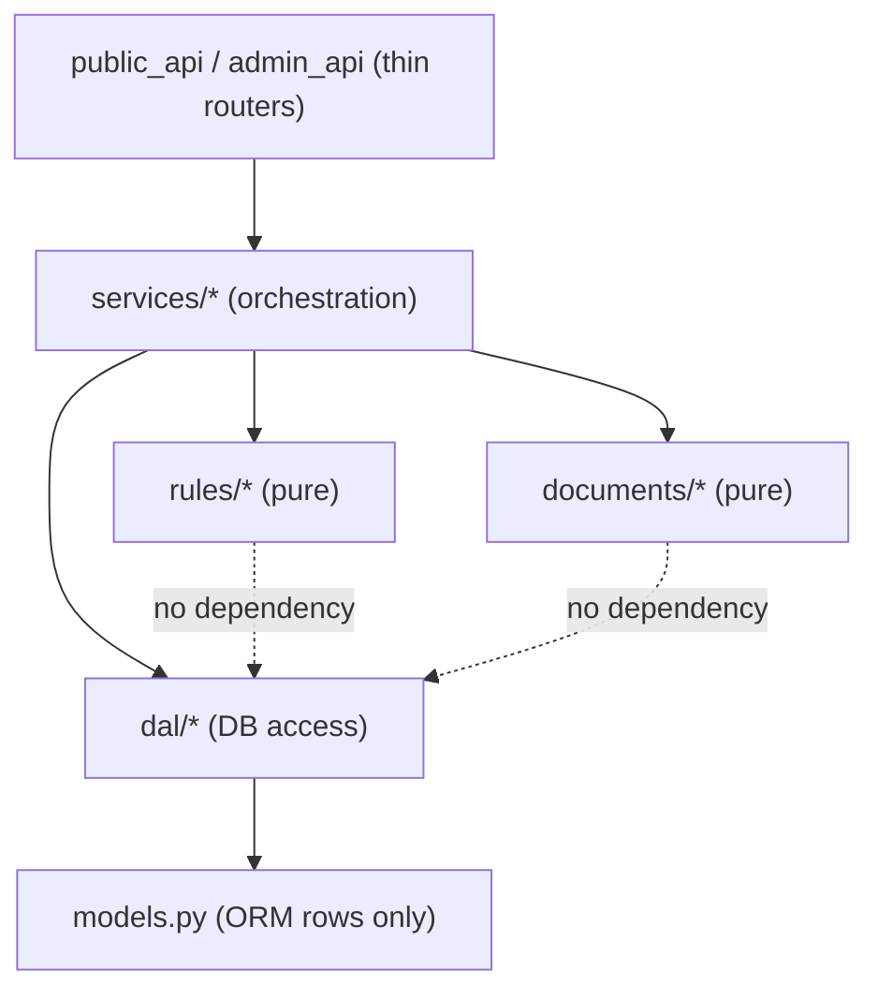

Arrows are the *only* allowed dependency directions. Pure libraries never depend downward into web/DB layers.

---

## 17. AI-editor-friendliness conventions

The PRD doesn't ask for this explicitly, but the user does — the codebase must be pleasant and safe for AI editors (Cursor) to extend. Principles and the conventions that encode them:

1. **Small, single-responsibility files** with descriptive names mirroring PRD vocabulary (`classification_service.py`, `annex_iii_employment.json` rule, etc.). Target <300 lines/file.
2. **Types/schemas as source of truth.** Pydantic models + JSON Schemas (`packages/rule-schema/`) define the contracts; the TS client is generated. An AI editor changing a field edits one place and regenerates.
3. **Colocated `AGENTS.md`** at root, `apps/web`, and `services/api` describing: what lives here, the invariants (e.g., "never put logic in `models.py`," "never hand-edit the generated client," "every new rule needs a fixture"), and how to run tests.
4. **Deterministic tests as guardrails.** The rule-engine fixture suite is the safety net: an AI edit that breaks legal logic fails CI immediately. Every new `RiskRule` must ship with a fixture (enforced in review).
5. **Explicit boundaries over cleverness.** No metaprogramming/`eval` in the engine; the condition interpreter is a readable recursive function. Prefer obvious code an AI can pattern-match.
6. **Self-describing data.** Rules/sources/questions are JSON with schemas, so adding a use case is a data edit + a fixture, not a code change — the highest-leverage, lowest-risk operation for an AI editor.
7. **Consistent error/result envelopes** so generated code and AI edits follow one pattern.
8. **One-command workflows** (`pnpm dev`, `pnpm test`, `api:test`) documented in `AGENTS.md` so an agent can self-verify.
9. **Cursor rules** (`.cursor/rules/`) capturing the invariants above as machine-enforced guidance, plus path-scoped rules (web vs api vs rules-engine).
10. **No hidden state.** Versioning is explicit; the engine is pure; jobs are idempotent — all properties that make AI-generated changes predictable and reviewable.

---

## 18. Non-functional requirements mapping

| NFR (PRD §11) | Design mechanism |
|---|---|
| Accuracy — deterministic, source-traceable, ambiguity flagged | Pure rule engine (§7.3); `needs_expert_review`/`insufficient_information`/`conflicting_rules`; LLM cannot decide status. |
| Performance — page <2s, result <10s, pack <2min | ISR static pages (§7.1); pure in-memory classification; async doc-gen with budget + retries (§10). |
| Security — encryption, signed URLs, RBAC, audit, deletion, no training | §12 controls. |
| Reliability — 99.5%, queued/retryable jobs, failure notices | §10 queue design; health checks (§14); managed infra. |
| Maintainability — file isolation, engine ≠ API, templates ≠ legal DB, no logic in models | §16 structure + layering rule; §17 conventions. |

---

## 19. Risks & mitigations

Extends the PRD §22 register with technical specifics.

| Risk | Sev | Technical mitigation |
|---|---|---|
| Legal classification error | High | Deterministic rules + source trace + fixture suite gating publishes + `needs_expert_review` + expert path. |
| Law changes | High | Versioned sources/rules, time-aware engine, impact analysis, regeneration, customer notices (§11). |
| Enterprise competitors copy features | Med | Moat is data (versioned legal graph + use-case corpus + traces), not infra (§3.5, PRD §6.3). |
| SEO erosion from AI overviews | High | Interactive calculators, downloadable assets, email capture, structured data for citation (§7.1, PRD §16.5). |
| Users expect legal advice | High | Positioning + disclaimers + expert-review handoff (§12). |
| Doc-gen cost/latency in serverless | Med | Typst (low memory) over headless Chrome; async workers; pre-rendered templates (§5.4, §7.4). |
| Bad rule publish ships | High | Publish gated on full fixture pass; instant rollback via immutable versions (§7.7, §14). |
| Vendor lock-in / cost creep (auth, LLM) | Med | Ports/adapters for auth, queue, LLM, storage (§5, §7.6). |
| Thin pSEO pages penalized | High | Publish guard requires source refs + unique content; pages composed from records, not LLM filler (§7.1). |
| Polyglot drift (TS/Python types) | Med | Generated client + CI drift check (§9, §15). |
| Payment edge cases (double-gen, replays) | Med | Webhook-as-truth + idempotency keys + signature verification (§7.5). |

---

## 20. Phased roadmap mapped to the PRD

Aligned to PRD §20. Each phase lists the design artifacts/components it activates. (Build happens later; this maps scope to the design above.)

| Phase | PRD ref | Scope | Activates |
|---|---|---|---|
| **0 — Research & rule-base design (1wk)** | §20 Phase 0 | Legal-source seed, core rule taxonomy, use-case taxonomy, output doc list, 20 validated examples | §7.3 rule schema, §8 data model, §11 versioning, seed data, fixture suite |
| **1 — MVP assessment & classifier (2wk)** | §20 Phase 1 | Wizard, rule engine, result page, admin source/rule CRUD, basic tests | §7.2, §7.3, §7.7, §9 (assessments), §15 fixtures |
| **2 — Doc generation & payments (2wk)** | §20 Phase 2 | PDF report, MD/DOCX templates, XLSX tracker, Stripe checkout, secure downloads | §7.4, §7.5, §10 jobs, §12 signed URLs |
| **3 — pSEO content engine (2wk)** | §20 Phase 3 | SEO model, page generator, 50 launch pages, sitemap, structured data, internal linking | §7.1, §15 SEO tests |
| **4 — Launch & sales (2wk)** | §20 Phase 4 | Public launch, outreach, content | observability/funnels (§14), GTM (PRD §24) |
| **5 — Workspace (post-MVP)** | §20 Phase 5, §8 | Inventory, evidence uploads, tasks, subscription billing, customer portal | auth orgs (§7.6), subscriptions (§7.5), new entities (§8) |

**Seams for post-MVP (PRD §8):** integration adapters (Jira/GitHub/Drive/Confluence/Slack/HubSpot), public API (reuse existing service layer + add API keys), multi-framework mapping (extend `Obligation` with framework cross-references), expert marketplace (review workflow on locked packs). The layered design (§16.1) means each is additive, not a rewrite.

---

## 21. Open questions & decision log

**Open questions (to resolve before/early in build):**
1. Auth: stay on Clerk through subscriptions, or move to custom JWT/Supabase before workspace launch (cost vs. speed)?
2. LLM provider + zero-retention terms for the prose layer; do we ship MVP entirely without LLM prose to reduce risk?
3. PDF: commit fully to Typst, or keep WeasyPrint as the only engine to reduce toolchain count?
4. Hosting for API/worker: Render vs. Fly.io (cold-start vs. global) — finalize in [cost-model.md](./cost-model.md).
5. Legal-source ingestion: manual admin entry only for MVP, or semi-automated EUR-Lex retrieval?
6. Search: how long can Postgres FTS serve before Meilisearch is warranted?

**Key decisions captured as ADRs:**
- [ADR-0001 — Stack & topology (polyglot Next.js + FastAPI)](./adr/0001-stack-and-topology.md)
- [ADR-0002 — Database: Neon serverless Postgres](./adr/0002-database-neon-postgres.md)
- [ADR-0003 — Deterministic rule engine design](./adr/0003-rule-engine-design.md)
- [ADR-0004 — Document generation pipeline (Typst + python-docx + openpyxl)](./adr/0004-document-generation-pipeline.md)
- [ADR-0005 — Versioning & legal traceability model](./adr/0005-versioning-and-traceability.md)

---

## 22. Appendix

### 22.1 Glossary

| Term | Meaning |
|---|---|
| Provider / Deployer / Importer / Distributor | AI Act actor roles determining which obligations apply (PRD §13 `ActorRole`). |
| Risk tier | prohibited / high-risk / limited-risk / minimal-risk / needs-review (PRD §13 `RiskTier`). |
| Annex III route | Use-case-based high-risk classification path (PRD §14.3 step 6). |
| Annex IV | Technical documentation content the skeleton maps to (PRD §17.4). |
| FRIA | Fundamental Rights Impact Assessment template (PRD §17.5). |
| Evidence-prep pack | The paid ZIP of source-cited review artifacts (PRD §7.2 F6). |
| RuleSet version | Immutable, published collection of rules pinned by each classification. |
| Source trace | The list of legal references justifying a result (PRD §10.2 FR-RE-002). |

### 22.2 Example deterministic result (from PRD §7.2 F3)

```json
{
  "assessment_id": "aia_123",
  "risk_tier": "high_risk",
  "confidence": "high",
  "triggered_rules": [
    {
      "rule_id": "annex_iii_employment_recruitment_selection",
      "source": "Regulation (EU) 2024/1689 Annex III point 4(a)",
      "rationale": "System is intended to analyse and filter job applications and evaluate candidates."
    }
  ],
  "required_review": false,
  "primary_actor_role": "provider",
  "secondary_actor_roles": ["deployer_when_used_internally"]
}
```

### 22.3 Worked rule examples (validation targets, PRD §18)

| Case | Expected tier | Trigger | Key obligations/docs |
|---|---|---|---|
| HR resume screening | high-risk | Annex III employment | provider + deployer split; risk memo, tech doc, instructions, oversight plan, evidence tracker |
| Credit scoring | high-risk | Annex III essential private services | FRIA may apply; risk mgmt, tech doc, monitoring, oversight |
| Customer support chatbot | limited/minimal | transparency (Art. 50) if interacting | transparency notice; no Annex III unless significant decisions |
| Spam filter | minimal | none | basic governance guidance only |

### 22.4 References (from PRD §28)

EU Commission AI Act implementation page; Regulation (EU) 2024/1689 (EUR-Lex); Eurostat 2025 enterprise AI adoption; McKinsey State of AI 2025; market sizing (Grand View, MarketsandMarkets, FMI); competitor positioning (OneTrust, Credo AI, Holistic AI, IBM watsonx.governance); AI-overview/zero-click research. **Legal article mappings used by rules:** Art. 11/Annex IV, Art. 13, Art. 14, Art. 16, Art. 17, Art. 26, Art. 27, Art. 43, Art. 47, Art. 49/Annex VIII, Art. 50 (PRD §1.4).

---

*End of Technical Design Document. Companion specs: [data-model.md](./data-model.md) · [api-contract.md](./api-contract.md) · [cost-model.md](./cost-model.md) · [ADRs](./adr/).*
